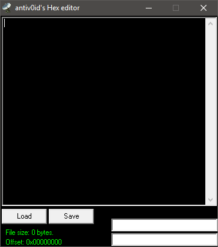

# antiv0id's Hex editor

### About:
A simple hex editor - shows only the hex bytes.

### Instructions:
Run the .exe, open a file and view or edit the hex bytes of it.

### Screenshot:

### Info:
**Created:** 2003

**Operating System:** Windows 2000 or newer

**Compile with:** Borland C++ Builder 6
